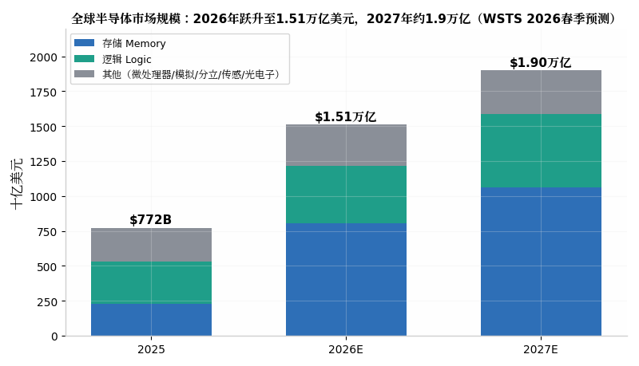
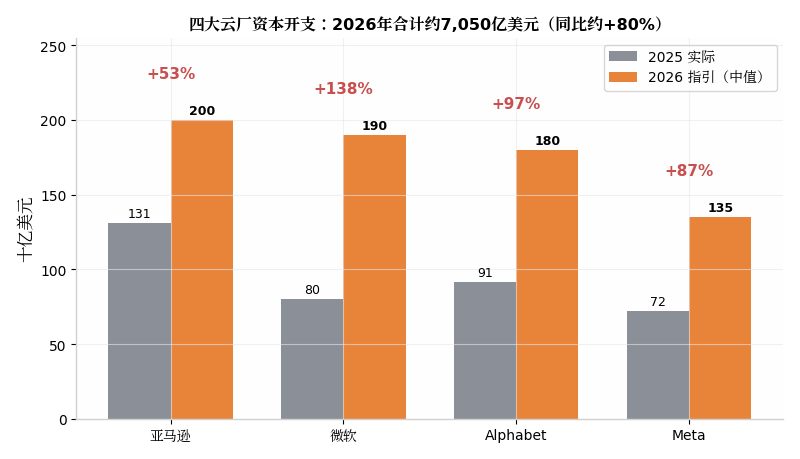
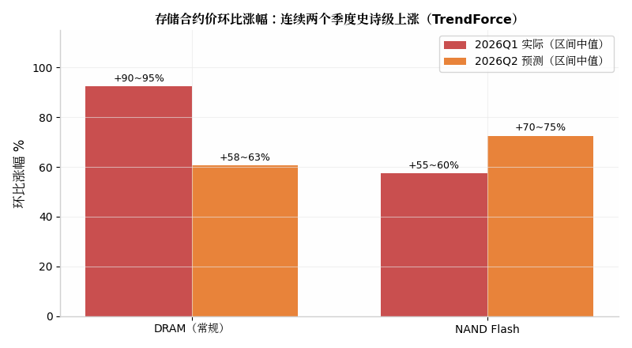
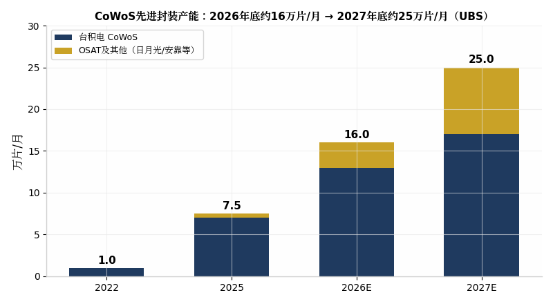
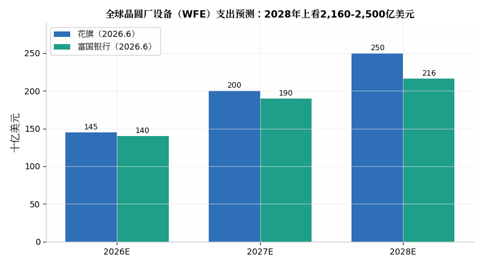
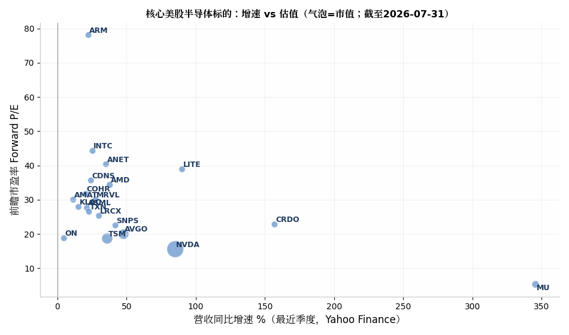
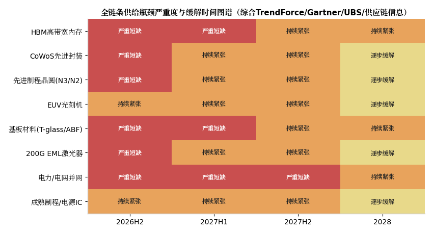

# 未来两年（2026H2–2028H1）全球半导体产业链深度拆解：确定性增长机会、美股受益标的与全链条瓶颈图谱

> 报告日期：2026 年 8 月 3 日。所有市场数据、公司经营数据与政策信息均引自公开来源（行内标注），行情与估值数据来自 Yahoo Finance（截至 2026 年 7 月 31 日收盘）。本报告仅供研究参考，不构成任何投资建议。

---

## 执行摘要

未来两年全球半导体产业将运行于一个"需求侧史无前例、供给侧处处受限"的紧平衡格局之中。WSTS 2026 年春季预测将 2026 年全球半导体销售额大幅上调至 **1.51 万亿美元（同比约 +90%）**，2027 年进一步达到约 **1.9 万亿美元（+27%）**；其中存储是最陡峭的增长引擎，2026 年预计同比激增约 **250% 至 8,000 亿美元以上**，逻辑芯片增长 37%[^5^][^6^]。Gartner 的口径同样激进：2026 年行业收入 +64% 突破 1.3 万亿美元，AI 芯片占比约 30%，DRAM 价格全年上涨约 125%、NAND 上涨约 234%，并将这一现象命名为"memflation"[^1^]。需求侧的总驱动是云厂资本开支——亚马逊、微软、Alphabet、Meta 四大云厂 2026 年资本开支指引合计约 **7,050 亿美元**（中值口径），摩根士丹利统计的更宽口径（含 Oracle）2026 年约 8,500 亿美元、2027 年约 1.3 万亿美元、2028 年可能达 1.5 万亿美元，且该行 CEO 称当前仅处于本轮投资周期的 10-15% 位置[^2^][^3^]。

在此坐标系下，本报告对两大命题的核心结论如下：

**命题一（增长机会与标的）**：确定性最高的六条主线按"瓶颈杠杆"排序为——（1）**存储/HBM**（美光 MU，美股纯度最高的受益者，FY26Q3 营收同比 +346%、毛利率 84.9%）[^35^][^37^]；（2）**定制 ASIC 设计服务**（博通 AVGO：AI 积压订单 730 亿美元、FY2027 AI 收入目标 >1,000 亿美元；迈威尔 MRVL）[^62^][^64^]；（3）**先进制程代工与先进封装的双重瓶颈**（台积电 TSM：2026 年营收增速指引 >40%、资本开支上调至 600-640 亿美元）[^8^][^14^]；（4）**半导体设备**（ASML、AMAT、LRCX、KLAC：WFE 支出 2026 年约 1,450 亿美元 → 2028 年 2,160-2,500 亿美元）[^55^][^58^]；（5）**网络与光互联**（ANET、COHR、LITE、CRDO，1.6T 光模块与 CPO 进入放量期）[^85^][^88^]；（6）**EDA/IP 寡头**（SNPS、CDNS、ARM，行业 13% CAGR 且穿越周期）[^80^]。英伟达（NVDA）仍是总需求的总阀门——GTC 2026 披露至 2027 年累计订单约 1 万亿美元[^67^]——但其弹性已被充分定价，边际超额收益更可能来自"瓶颈的收租者"而非"需求的代名词"。

**命题二（瓶颈与约束）**：未来两年的约束体系呈五层叠加——硬供给瓶颈（HBM 2026 年产能全数售罄且 2027 年缺口扩大[^29^]；CoWoS 供需缺口 2026 年中仍约 10%[^54^]；T-glass 玻纤布、ABF 膜、氦气等材料新增产能需 2-4 年[^60^]；200G EML 激光器为光链条最紧环节[^88^]）；技术卡点（GAA/背面供电良率爬坡、High-NA EUV 经济性验证、HBM4 堆叠良率、CPO 封装良率约 50% 起步）[^52^][^94^]；政策约束（美国对 H200 级芯片征收 25% 关税+对华出口 25% 收入分成、中国设备国产化率已达 35% 并强制新产线国产化率 ≥50%）[^82^][^118^]；资本开支约束（台积电单年 600-640 亿美元、美光 >250 亿美元的创纪录投入，以及云厂自由现金流与折旧的双重挤压）[^8^][^15^]；成本刚性（2nm 晶圆约 3 万美元/片、A16 或达 4.5 万美元，单 die 成本较 3nm 上升约 80%，"晶体管变便宜的时代"正式终结）[^94^][^100^]。**电力是 2027-2028 年最致命的硬约束**：30-50% 计划中的 2026 年 AI 数据中心产能因并网排队推迟至 2028 年，Gartner 预计 2027 年 40% 的 AI 数据中心将受电力短缺限制[^92^][^93^]。

---

## 一、总坐标系：超级周期的量级、结构与成色

本轮周期与 2020-2022 年疫情缺芯有本质区别。上一轮是恐慌性重复下单驱动的库存周期，需求正常化后渠道库存迅速出清；本轮则是**消费型缺货**——T-glass、氦气、ABF 膜、N3 晶圆产能、HBM 晶圆投片均是在生产中被实际消耗掉的，供给端的唯一解是新建产能，而这类产能的建设周期普遍为 2-4 年[^60^]。这决定了紧平衡不是季度级别、而是年度级别的现象。从量级看，四大云厂 2026 年资本开支中值合计约 7,050 亿美元（亚马逊约 2,000 亿、微软约 1,900 亿、Alphabet 1,750-1,850 亿、Meta 1,250-1,450 亿），较 2025 年约 3,745 亿美元近乎翻倍；且微软明确表示其增量中约 250 亿美元纯粹是存储等元器件涨价所致，Meta 两次上调指引也归因于元件价格[^2^][^3^]。这意味着**存储涨价已经在直接吞噬云厂的资本开支效率**——同样的美元买到更少的算力，这是本轮周期最具传导力的成本变量。

结构上，本轮增长的"含 AI 量"极高且高度集中。WSTS 分品类数据显示，2026 年 1.51 万亿美元中存储占 8,039 亿（+249.5%）、逻辑占 4,114 亿（+37.3%），而模拟仅 +10.2%、分立 +8%、传感与光电子 +3%[^6^]。区域上美洲 2026 年预计 +112%，亚太 +87%，欧洲 +58%，日本 +28%——增长极几乎完全锚定北美 AI 基建与亚太制造链[^6^]。Gartner 同时警告，memflation 将"毁灭或至少延迟"非 AI 需求至 2028 年，因为智能手机、PC、汽车等终端必须消化翻倍以上的存储成本[^1^]。换言之，**未来两年的产业图景是"AI 链的通胀繁荣"与"非 AI 链的成本衰退"并存**，这一点对标的选择至关重要：纯 AI 链标的享受量价齐升，而消费暴露度高的标的将被元件成本反噬毛利率。

资本开支的传导链已经形成了清晰的"水位图"：云厂 7,050 亿美元 → 英伟达/AMD/博通等芯片订单 → 台积电先进制程与 CoWoS 产能 → ASML/应用材料等设备订单 → 材料与基板消耗。每一层都在 2026 年上半年给出了上修而非下修的证据：台积电 7 月将全年资本开支从 520-560 亿美元上调至 600-640 亿美元、营收增速指引从 >30% 上调至 >40%，并将 AI 加速器收入至 2029 年的 CAGR 指引从约 45% 上调至 54-56%[^9^][^16^]；ASML 将 2026 年营收指引上调至 430-450 亿欧元，并宣布 2027、2028 年低 NA EUV 与浸没式 DUV 产能各扩张 30%，其 CFO 明确表示 2027 年 EUV 订单已接近全覆盖、2028 年也已收到"数量可观"的订单[^51^][^53^]。设备厂的订单能见度直接延伸到 2028 年，这是判断"周期成色"最硬的供给侧证据。

---

## 二、命题一：自上而下各赛道确定性增长机会、催化节点与核心美股标的

### 2.1 算力芯片层：GPU 与定制 ASIC 的双轨通胀

算力芯片是整条产业链的价值锚点。英伟达在 GTC 2026 上披露至 2027 年的累计订单约 **1 万亿美元**，其数据中心收入在两年内从 475 亿美元复合增长至 1,937 亿美元；Vera Rubin 平台于 2026 年下半年放量，VR200 机柜单柜功率约 190-230kW、单柜售价高达 500-880 万美元，每个 Rubin GPU 需 8 颗 HBM4 堆叠（288GB）[^67^][^31^][^76^]。英伟达的约束不在需求而在供给：其锁定了台积电约 60% 的 CoWoS 产能（约 59.5 万片）并预订了 2026-2027 年扩产量的一半以上，但 2026 年 Rubin 出货共识仅 25-35 万颗，核心制约正是 CoWoS 交期（52-78 周）与 HBM4 配额——SK 海力士 4 月曾考虑将对英伟达的 2026 年 HBM4 出货量削减 20-30%[^31^][^61^]。AMD 方面，MI450 获得 Meta 首个吉瓦级部署（2026 年下半年），并传出与 Intel Foundry 的 18A/14A 设计合作以对冲台积电产能挤占[^18^][^20^]。

定制 ASIC 是算力层未来两年**斜率最陡的结构性机会**。摩根大通测算数字 AI ASIC 市场 2026 年达 600-700 亿美元、未来数年 CAGR 超 40-50%，并判断定制芯片出货量可能在 2027 年反超 GPU；博通占高端 ASIC 市场约 80-85% 份额，迈威尔约 10-12%[^64^]。博通的基本面已经是"订单驱动"而非"预期驱动"：AI 半导体收入 FY26Q1 达 84 亿美元（+106%）、FY26Q2 指引 107 亿美元（+140%）、FY26Q3 指引约 160 亿美元；AI 积压订单 730 亿美元、能见度延伸至 2027 年中以后，管理层给出 FY2027 AI 芯片收入超 1,000 亿美元的"视线内"目标；六大 XPU 客户（谷歌、Meta、OpenAI、Anthropic、苹果及一家未披露客户）中谷歌 TPU 长约锁定至 2031 年，Anthropic 单家已下达两笔合计约 210 亿美元的 TPU 机架订单[^62^][^65^][^66^][^69^]。迈威尔卡位第二极：AWS Trainium3 于 2026Q2 投产、Trainium4 已开发并整合 NVLink Fusion，微软 Maia 持续放量，管理层给出 FY2027 收入约 115 亿美元、FY2028 约 165 亿美元的指引，且存在标普 500 纳入的机械性买盘催化[^69^][^71^]。

**催化节点**：英伟达 2026 年 8 月底财报（FY27Q2）与 Rubin 放量斜率；AMD MI450 吉瓦级部署进度（2026H2）；博通 2026 年 9 月 FY26Q3 财报（验证 160 亿美元 AI 收入指引与 FY27 千亿目标）；迈威尔标普 500 纳入评审；OpenAI 自研"Titan"推理 XPU 流片（2027-2029 年窗口）[^66^]。

### 2.2 存储与 HBM：本轮周期最锋利的"量价齐升"

存储是 2026 年全产业最确定的赛道，没有之一。三大 HBM 厂（SK 海力士、三星、美光）2026 年产能已在 7 月 25 日韩美 AI 峰会前**全部售罄**，新产能要到 2027-2028 年才能形成有效供给；三星存储业务负责人 4 月 30 日明确表示短缺将至少持续到 2027 年，且基于在手订单，**2027 年供给缺口将比 2026 年更大**[^28^][^29^]。价格方面，常规 DRAM 合约价 2026Q1 环比 +90-95%、Q2 预计 +58-63%；NAND 合约价 Q1 +55-60%、Q2 预计 +70-75%；DDR5 合约价 4 月已达约 13 美元/GB、现货 25-27 美元/GB，32GB DDR5 模组从 149 美元涨至约 239 美元[^29^][^43^]。采购模式也发生结构性转变：三大厂对北美云厂改用"后结算定价"（期末按市场价上调补差），传统的 ±10% 季度价格带彻底消失，产能优先分配给签多年期承诺并预付定金的客户[^29^]。

美股最纯的受益标的是**美光（MU）**。FY26Q3（截至 2026 年 5 月）营收 414.6 亿美元（同比 +346%）、non-GAAP 毛利率 84.9%（去年同期 39%）、EPS 25.11 美元，云存储收入 137.7 亿美元（去年同期 33.9 亿）；FY26Q4 指引约 500 亿美元营收、毛利率约 86%[^35^][^37^][^39^]。更关键的是商业模式的重估：美光披露 **16 份多年期战略客户协议、合计 1,000 亿美元最低收入承诺，客户预付 220 亿美元定金锁产能**；公司只能满足当前 HBM 需求的 1/2 到 2/3，新产线 FY2028 年前无法贡献有效产出[^40^]。HBM 每 GB 消耗约 3 倍于 DDR5 的晶圆产能，且已占全球 DRAM 晶圆投片的 23%（两年前仅为个位数），这种"挤出效应"正是常规 DRAM 同步暴涨的微观机制[^40^][^92^]。竞争格局上，SK 海力士以 56-57% 份额领先（独家供应微软 Maia 200、预计供英伟达 HBM4 的约 2/3），三星 HBM4 已于 2026 年 2 月量产出货、HBM4E 良率超 70%，美光 HBM4 已为某头部客户平台量产[^32^][^34^][^41^]。风险变量是中国 CXMT：若其年底达 35 万片/月投片，常规 DRAM 供给将增加约 25-30%，2027 年对常规 DRAM 价格形成尾部压制，但其 HBM 能力（12 层 HBM 目标 2027 年）距一线仍有 2-3 年差距[^33^][^36^]。

**催化节点**：美光 FY26Q4 财报（2026 年 9 月下旬）与 FY2027 指引；HBM4 在 Rubin 平台的实际放量（2026H2）；三大厂 2027 年长约谈判（2026Q4 启动，后结算条款是否延续）；CXMT 投片节奏与 HBM 进展（2027 年验证点）。

### 2.3 先进制程代工：台积电的"双重垄断"与英特尔的对赌窗口

代工层的核心事实是：**先进制程产能本身已成为与 HBM、CoWoS 并列的第三重瓶颈**。台积电 N3/N2 全部产能被英伟达、苹果、AMD、博通锁定，CoWoS 之外，N3 晶圆投片与光罩产能也在限制 Rubin 放量[^22^][^31^]。台积电 2026 年经营数据全线创纪录：Q2 净利润同比 +77% 至约 220 亿美元，Q3 营收指引 446-458 亿美元（同比约 +37%）、毛利率指引 65-67%；全年资本开支上调至 600-640 亿美元（其中 70-80% 投向 N3/N2/A16 先进制程，10-20% 投向先进封装），并宣布对亚利桑那园区追加 1,000 亿美元投资[^8^][^10^][^14^]。技术路线图上，N2 已于 2025Q4 量产（256Mb SRAM 良率超 90%），N2P 与 A16（纳米片+背面供电 Super Power Rail）2026H2 投产、客户放量在 2027 年，英伟达为 A16 首发客户，苹果据传跳过 A16 直奔 A14；2nm 及以下产能 2026-2028 年规划 CAGR 达 70%[^23^][^94^]。定价权是台积电最深的护城河：N2 晶圆约 3 万美元/片（较 N3 的约 2 万 +50%），单 die 成本因良率与光刻步骤增加实际上升约 80%，且行业判断其垄断定价权至少维持到 2027 年底——三星 2nm GAA 要到 2026 年底/2027 年初风险量产、有效客户放量在 2028 年[^95^][^100^]。

**英特尔（INTC）是未来两年代工层最大的期权型标的**。正面证据：18A 已用于 Panther Lake（已出货、200+ 笔记本设计）与 Clearwater Forest，良率据报从约 65% 提升至 85%（接近台积电 N2 的 90%，远高于三星 SF2 的 50-60%）；Intel Foundry 已获 4 家外部客户，KeyBanc/FactSet 报道其 18A/14A 获得 AMD、英伟达、Marvell、微软、美光、OpenAI 等设计导入，EMIB 先进封装良率达 98%，代工业务目标 2027 年底经营盈亏平衡[^12^][^17^][^20^]。负面证据同样清晰：14A 产能投资以"先拿客户承诺"为前提、风险量产 2028/量产 2029，若外部收入不及规模，管理层公开讨论过放缓甚至取消 14A 及后续节点；且英特尔自家 Nova Lake 桌面 CPU 超 90% 的 tile 仍交由台积电 N2 制造——其转型叙事的可信度需要用 2026H2 的外部客户签约来兑现[^22^][^26^]。英特尔股价过去六个月在 18-32 美元区间宽幅波动（2026 年 7 月底已升至约 90 美元，Yahoo Finance），市场已在为"陈立武扭转+美国政府 9.9% 股权+英伟达 50 亿美元入股"的复合故事定价[^12^][^17^]。

**催化节点**：台积电 2026 年 10 月 Q3 财报（资本开支是否再上修）；A16 量产爬坡与英伟达首发产品（2026H2-2027）；英特尔 2026H2 14A 客户承诺官宣（成败分界点）；三星 2nm 风险量产与泰勒厂进展（2026Q4-2027H1）。

### 2.4 先进封装与测试：从"后道工序"升格为"战略产能"

先进封装是未来两年**产业地位重估幅度最大**的环节。台积电 CoWoS 月产能从 2022 年约 1 万片增至 2025 年约 7 万片，2026 年底达 12-14 万片，2027 年 17 万片（部分规划指向 20 万片）；全行业口径（含日月光/矽品、安靠等 OSAT）从 2026 年底约 16 万片/月增至 2027 年底约 25 万片/月，年增 56%（UBS），非台积电阵营到 2027 年底将提供约 8 万片/月的第二供给[^48^][^50^]。供需缺口已从 2024 年的约 20% 收窄至 2026 年中的约 10%（TrendForce），但需求端 Rubin、AMD Venice、谷歌 TPU、亚马逊 Trainium 四线并进，缺口闭合时点不早于 2028 年；台积电管理层亦承认 CoWoS 差距 2026 年内无法弥合[^27^][^54^]。技术迭代打开了第二增长曲线：2026 年台积电量产全球最大 5.5 倍光罩 CoWoS（良率 >98%），2028 年 14 倍光罩、集成 20 颗 HBM 的版本量产，2029 年 24 颗 HBM 版本就绪；CoPoS 面板级封装 2026 年 6 月完成研发认证、2027 年中试产，以英伟达 Feynman 平台（2028-2029）为首发载体；SoIC 产能上修至 2027 年 5 万片/月，设备订单能见度直达 2030 年[^48^][^50^][^54^]。

美股映射：台积电（TSM）本身是第一受益者（先进封装收入占比 2025 年约 8%、2026 年将超 10%）[^57^]；**安靠（AMKR）**是纯 OSAT 中弹性最大的美股标的（CoWoS 产能 2026 年底 2 万→2027 年底 3 万片/月，聚焦 CoWoS-L/R）；设备侧的**应用材料、KLA**则受益于封装环节的沉积/键合/量测设备密度提升。英特尔 EMIB 以 98% 良率成为台积电之外的"侧门"——英伟达 Feynman 交易本身即以 EMIB 为核心，封装收入可能先于晶圆代工收入为英特尔代工业务造血[^17^][^20^]。

**催化节点**：CoPoS 试产线投产（2027 年中）；台积电亚利桑那首座封装厂量产（2028）；OSAT 季度财报中先进封装产能利用率与资本开支（2026Q3 起逐季验证）。

### 2.5 半导体设备：WFE 超级周期的"卖铲人"

设备层是未来两年**能见度最长**的赛道。花旗与富国银行 2026 年 6 月同步上修 WFE 预测：2026 年约 1,400-1,450 亿美元（+25-30%）、2027 年 1,900-2,000 亿美元（+31-43%）、2028 年 2,160-2,500 亿美元；结构上 2027 年存储相关 WFE 占比将从 2026 年的约 28% 升至 36%，逻辑/代工维持 48-52%[^55^][^58^]。ASML 是其中订单能见度最极端的样本：2026Q2 净预订 83 亿欧元（高于预期的 60 亿），管理层将 2026 年营收指引上调至 430-450 亿欧元（存储类设备收入预计 +75%），并宣布 2027、2028 两年低 NA EUV 与浸没式 DUV 产能各扩张 30%；CFO 明确表示 2027 年 EUV 订单接近全覆盖、2028 年已收到可观订单[^51^][^53^]。High-NA EUV 是 2027 年后的期权：ASML 预计 2028 年 High-NA 出货量翻倍，SK 海力士已接收首台 NXE:5200B 并应用于存储制造，台积电基于"成本与良率权衡"暂不急于导入，英特尔则优先在 14A 验证——三方态度分化本身就是 2nm 以下技术经济性的缩影[^51^][^52^]。

四大美股设备商的受益结构各有侧重：**应用材料（AMAT）**受存储与先进封装（键合/沉积）双重拉动，管理层判断 2026 年 DRAM 设备增速为近年最强；**泛林（LRCX）**在 NAND 层数升级（400+ 层）与 DRAM 1γ/1δ 节点的刻蚀/沉积密度提升中弹性最大；**KLA（KLAC）**受益良率管理刚需——GAA、背面供电、HBM 堆叠、CoPoS 面板化每一步技术跃迁都提高过程控制设备密度，其先进封装业务收入增速显著高于整体。SEMI 数据显示，设备商在手订单/积压普遍创历史新高，交期拉长本身成为客户提前下单的放大器[^58^]。中国变量值得单列：中国设备国产化率 2026 年已达约 35%，新产线国产化率强制要求 ≥50%，ASML 在华销售占比从峰值 49% 降至 2026 年指引约 20-25%——中国市场的"去美化"是四大设备商中长期的份额天花板[^118^]。

**催化节点**：ASML 2026 年 10 月 Q3 财报（订单与 2027 年能见度确认）；High-NA EUV 商业化量产验证（2027-2028）；各家季度财报中存储设备收入占比逐季验证；美国对华设备出口管制是否进一步收紧（随时）。

### 2.6 材料、基板与零部件：瓶颈最上游、美股纯度最低的"影子赛道"

材料层是本轮周期中**涨幅预期被系统性低估**的环节，但其美股可投标的稀缺，主要以"间接受益"形式存在。瓶颈清单如下：T-glass/低介电玻纤布（AI 服务器 PCB 核心材料，交期拉长至 40 周以上，2027 年新增产能才能释放）；ABF 载板膜（味之素近乎垄断，扩产周期 2-3 年）；氦气（卡塔尔供应集中，EUV 光刻必需）；六氟丁二烯等特气（美韩双垄断）；MLCC（AI 机柜单柜用量为传统服务器 10 倍，村田/TDK 交期 20+ 周）；硅片（12 英寸高端硅片信越/SUMCO 长约锁定至 2028）[^60^]。TrendForce 与供应链调研显示，这些材料的共性特征是：**产能建设周期 2-4 年、认证周期 6-18 个月、且价格传导滞后于芯片价格 2-3 个季度**——这意味着 2026 下半年至 2027 年材料涨价将加速，成为芯片厂毛利率的"隐形税"[^60^]。

美股映射较为间接：**应用材料、KLA** 的过程控制受益于材料波动带来的良率管理需求；**AOS（Alpha and Omega）**、**安森美（ON）**等功率器件厂部分受益于 MLCC/被动元件紧缺带动的电源方案价值量提升；基板侧 A 股/日股标的（欣兴、揖斐电、味之素）纯度高但不在本报告标的范围内。对美股投资者而言，材料层的正确定位是**风险信号源而非收益来源**——T-glass 或氦气的供应事故（如 2022 年俄乌冲突冲击氖气）可能在任何时点成为 AI 链放量的黑天鹅约束。

### 2.7 网络、光互联与机柜级配套：AI 集群的"第二瓶颈"转向

随着单芯片算力供给逐步解锁，集群内互联正成为新的性能天花板，网络与光通信是 2026-2027 年增速最快的配套赛道。以太网在 AI 后端网络中的份额持续提升（超以太网联盟 UEC 规范落地），1.6T 光模块 2026 年进入放量元年，3.2T 于 2027-2028 年接棒；CPO（共封装光学）从 2026 年的试产爬坡进入 2027 年放量——博通 Tomahawk 6（102.4T）交换芯片与英伟达 Spectrum-6 CPO 交换机均已量产，但 CPO 封装良率仅约 50% 起步，爬坡期毛利压力与放量斜率并存[^85^][^94^]。

美股标的梯队清晰：**Arista（ANET）**是 AI 后端以太网交换的纯度最高标的（2025 年营收约 84 亿美元、增速 30%+，云巨头客户占比高）；**Coherent（COHR）**与**Lumentum（LITE）**卡位光器件最紧环节——200G EML 激光器被供应链公认为光链条最短缺的单点，Lumentum 因产能稀缺获得超额定价权（2026 年 7 月股价年内最高涨幅近 10 倍，Yahoo Finance 52 周区间 106-1,086 美元）；**Marvell（MRVL）**的 Ara 1.6T DSP 与 Credo（CRDO）的有源电缆 AEC/线卡 SerDes 分别在光 DSP 与短距铜互联两端受益，Credo 最近季度营收同比 +157%，是配套层增速之最[^71^][^88^]。电源侧，Rubin 机柜 190-230kW 功率密度使 **Vertiv（VRT）**、**Eaton** 的液冷与电源管理成为确定性配套，但其已超出半导体本体范畴，本报告不展开[^76^]。

**催化节点**：1.6T 光模块出货爬坡与 200G EML 产能释放（2026H2-2027H1）；CPO 良率与渗透率验证（2027）；博通/英伟达下一代交换芯片发布（2027GTC）；UEC 1.0 规范商用部署（2027）。

### 2.8 EDA 与 IP：穿越周期的"卖水人"

EDA/IP 层是整个产业链中**商业模式最优**的环节：双寡头（Synopsys、Cadence 合计份额约 70%）+ Arm 构成三极，行业增速稳定在 13% 左右 CAGR，且收入以多年期订阅/授权为主，对单一客户资本开支波动的敏感度远低于芯片本体[^80^]。未来两年的增量逻辑有三：其一，定制 ASIC 爆发直接放大设计服务与 IP 授权需求——每一颗新 XPU 都意味着数千万美元级 EDA 工具合同与 Arm/接口 IP 授权费；其二，AI for EDA（如 Synopsys.ai、Cadence Cerebrus）提升工具价值量并支撑提价；其三，Arm 在数据中心的渗透加速——Neoverse CSS 平台被微软 Cobalt、谷歌 Axion、AWS Graviton4 采用，Arm 数据中心版税率提升至服务器芯片 ASP 的约 2 倍，且其自研芯片计划（与 Meta 合作）打开新收入曲线[^80^]。

估值是需要提示的约束：Arm 前瞻市盈率约 78 倍、Cadence 约 36 倍、Synopsys 约 22 倍（Yahoo Finance，2026-07-31），EDA/IP 的"确定性溢价"已大部分计入价格。Synopsys 相对低估的原因是其 Ansys 并购整合与英特尔代工敞口的拖累，若英特尔 14A 成功反而是其隐含期权。

### 2.9 成熟制程、模拟与功率：被 AI 挤出效应波及的"慢变量复苏"

非 AI 链的叙事与 AI 链截然相反：memflation 推高 BOM 成本压制消费终端需求，但供给侧的产能挤出（存储厂将成熟产能转投 HBM/先进节点）又让成熟制程部分品类出现结构性短缺[^1^][^60^]。德州仪器 2026 年 4 月上调工业与汽车指引并启动结构性提价，电源管理 IC 全年短缺；安世（Nexperia）管制危机推升 MOSFET/逻辑现货价 15-30%，凸显成熟制程供应链的地缘脆弱性[^102^]。美股标的中，**德州仪器（TXN）**是模拟复苏的第一代理（300mm 产能成本优势+库存周期见底），**安森美（ON）**承载 SiC/汽车功率的长期期权但短期受 EV 需求疲软压制（营收增速仅 +4.7%），**Microchip、ADI** 依循工业库存回补逻辑[^102^]。这一层的正确姿势是"左侧布局+耐心持有"：工业/汽车半导体库存周期在 2026 年见底、2027 年回补的置信度较高，但弹性显著小于 AI 链。

---

## 三、命题一总结：赛道-标的-催化总表

下表汇总各细分赛道的确定性评级、核心美股标的、受益逻辑与关键催化/验证节点。确定性评级综合考虑需求能见度（订单/长约覆盖率）、供给壁垒（产能稀缺性）与定价权三要素；行情与估值数据来自 Yahoo Finance（截至 2026 年 7 月 31 日收盘），"[Source: Yahoo Finance — get_stock_info, as of 2026-07-31]"统一标注于表注。

| 赛道 | 确定性 | 核心美股标的 | 受益逻辑一句话 | 未来两年关键催化/验证节点 |
|---|---|---|---|---|
| 存储/HBM | ★★★★★ | **MU**（第一受益）、SNDK | 2026 产能售罄+16 份长约 1000 亿美元承诺+220 亿预付款；FY26Q3 毛利率 84.9%[^37^][^40^] | 9 月 FY26Q4 财报（营收指引约 500 亿）；2027 长约谈判；CXMT 投片节奏 |
| 定制 ASIC | ★★★★★ | **AVGO**、MRVL | AI 积压 730 亿美元、FY27 AI 收入目标 >1000 亿美元；TPU 长约至 2031[^62^][^65^] | 9 月 FY26Q3 财报；Anthropic/OpenAI XPU 流片；MRVL 标普 500 纳入 |
| 先进制程代工 | ★★★★★ | **TSM** | N3/N2 全锁定、2026 营收 +40%+、资本开支 600-640 亿美元、N2 垄断定价至 2027[^8^][^95^] | 10 月 Q3 财报；A16 放量（2026H2-2027）；亚利桑那追加 1000 亿美元进展 |
| 先进封装 | ★★★★☆ | TSM、**AMKR**、INTC(EMIB) | CoWoS 缺口 2028 年前不闭合；CoPoS 2027 试产打开面板级空间[^48^][^54^] | CoPoS 试产（2027 中）；OSAT 产能利用率逐季验证 |
| 算力 GPU | ★★★★☆ | **NVDA**、AMD | 至 2027 累计订单约 1 万亿美元；Rubin 2026H2 放量；AMD MI450 获 Meta 吉瓦级部署[^18^][^67^] | 8 月底 NVDA 财报；Rubin 出货斜率；MI450 部署进度 |
| 半导体设备 | ★★★★☆ | **ASML、AMAT、LRCX、KLAC** | WFE 2026-2028：1450→2000→2500 亿美元；ASML 2027 EUV 订单近全覆盖[^51^][^55^] | ASML 10 月财报；High-NA 量产验证（2027-28）；存储设备占比逐季验证 |
| 网络/光互联 | ★★★★☆ | **ANET、COHR、LITE**、CRDO、MRVL | 1.6T 放量元年+200G EML 最紧缺+CPO 2027 放量[^85^][^88^] | 200G EML 产能释放；CPO 良率爬坡；2027GTC 交换芯片 |
| EDA/IP | ★★★★☆ | **SNPS、CDNS**、ARM | 13% CAGR 穿越周期+ASIC 设计潮+Arm 数据中心版税翻倍[^80^] | ASIC 流片潮带动授权费；Arm 自研芯片进展 |
| 代工期权 | ★★★☆☆ | **INTC** | 18A 良率 85%+4 家外部客户+EMIB 98% 良率；14A 成败 2026H2 定夺[^17^][^20^] | 2026H2 14A 客户承诺；2027 年底代工盈亏平衡目标 |
| 模拟/功率 | ★★★☆☆ | **TXN**、ON、ADI | 库存周期 2026 见底+电源管理 IC 结构性短缺+TXN 提价[^102^] | 工业/汽车库存回补（2027）；EV 需求拐点 |

*表注：评级为主观综合判断；个股行情与估值数据见第四章。[Source: Yahoo Finance — get_stock_info, as of 2026-07-31]*

从组合构建角度，本报告提炼三条配置思路供参考。其一，**"瓶颈收租"组合**——MU（存储涨价）、TSM（产能垄断）、ASML（设备订单）——三者分别对应三重最硬供给瓶颈的定价权，其超额收益的来源是"量增之外的价升"，对 AI 需求增速放缓的敏感度相对更低；其二，**"订单能见度"组合**——AVGO（730 亿美元积压+2031 长约）、NVDA（1 万亿美元订单池）、ANET（云厂以太网资本开支）——适合作为 AI 基建主线的核心持仓，波动来自估值而非基本面；其三，**"期权型"卫星仓**——INTC（14A 客户承诺与政府/英伟达入股的复合期权）、MRVL（FY28 165 亿美元指引+指数纳入）、COHR/LITE（200G EML 稀缺定价）——赔率驱动，需要以催化节点为纪律做仓位管理。

上图直观呈现了当前定价结构：横轴为最近季度营收同比增速、纵轴为前瞻市盈率。右下角的 **MU（增速 +346%、前瞻 P/E 约 5.3 倍）**是全图最极端的"高增速-低估值"组合，反映市场对存储周期持续性的深度怀疑——这正是预期差所在；**NVDA（+85%、约 15.6 倍）**在 AI 链中估值反而最便宜；而 **ARM（+22%、约 78 倍）**与 **LITE（+90%、约 39 倍，年内已涨近 10 倍）**则已充分定价。INTC 的前瞻 P/E 约 44 倍说明其股价已计入大量转型预期，安全边际有限。[Source: Yahoo Finance — get_stock_info, as of 2026-07-31]

---

## 四、核心标的一览：行情与估值数据

下表为 20 只核心美股标的的最新行情与估值快照，供标的筛选参考。[Source: Yahoo Finance — get_stock_info, as of 2026-07-31]

| 标的 | 现价($) | 市值($B) | 前瞻P/E | 营收增速% | 毛利率% | 分析师目标价均值($) | 评级 |
|---|---|---|---|---|---|---|---|
| NVDA | 200.75 | 4,862 | 15.6 | +85.2 | 74.1 | 302.8 | strong_buy |
| MU | 823.03 | 930 | 5.3 | +345.7 | 72.6 | 1,522.3 | strong_buy |
| AVGO | 389.28 | 1,852 | 20.0 | +47.9 | 76.3 | 527.9 | strong_buy |
| TSM | 404.25 | 2,097 | 18.7 | +36.0 | 64.2 | 540.2 | strong_buy |
| AMD | 476.15 | 776 | 34.3 | +37.8 | 53.1 | 579.1 | strong_buy |
| ASML | 1,629.00 | 626 | 27.6 | +21.3 | 52.7 | 2,139.1 | strong_buy |
| AMAT | 507.67 | 403 | 30.0 | +11.4 | 49.0 | 627.7 | strong_buy |
| LRCX | 293.02 | 367 | 25.3 | +30.0 | 50.5 | 368.1 | strong_buy |
| KLAC | 182.82 | 239 | 27.9 | +15.2 | 61.3 | 230.9 | buy |
| MRVL | 187.56 | 168 | 30.1 | +27.6 | 51.5 | 256.9 | strong_buy |
| ANET | 180.35 | 227 | 40.4 | +35.1 | 63.5 | 192.3 | strong_buy |
| COHR | 262.89 | 51 | 31.7 | +20.5 | 37.0 | 391.5 | buy |
| LITE | 713.94 | 56 | 38.9 | +90.1 | 40.8 | 1,104.9 | buy |
| CRDO | 206.99 | 39 | 22.8 | +157.0 | 68.0 | 279.3 | strong_buy |
| ARM | 239.69 | 256 | 78.1 | +22.4 | 97.5 | 286.8 | buy |
| SNPS | 388.76 | 74 | 22.5 | +41.9 | 82.6 | 564.4 | buy |
| CDNS | 340.02 | 94 | 35.7 | +24.2 | 85.9 | 403.7 | strong_buy |
| TXN | 275.74 | 252 | 26.5 | +22.8 | 58.3 | 324.5 | buy |
| ON | 81.61 | 32 | 18.8 | +4.7 | 42.7 | 113.1 | buy |
| INTC | 90.20 | 455 | 44.3 | +25.4 | 38.9 | 115.3 | hold |

两点解读值得强调。第一，**目标价隐含空间与评级高度集中在"strong_buy"**，反映卖方对 AI 链的一致乐观——这本身是双刃剑：一致预期下的边际定价更依赖超预期的财报兑现，任何资本开支指引下修都可能引发剧烈回撤。第二，**估值分层极其清晰**："瓶颈收租"层（MU 5.3x、NVDA 15.6x、TSM 18.7x、AVGO 20.0x）显著低于"稀缺叙事"层（ARM 78x、INTC 44x、ANET 40x、LITE 39x），前者赚盈利兑现的钱、后者赚叙事延续的钱，风险收益结构完全不同，不宜混同管理。

---

## 五、命题二：全链条硬瓶颈与约束体系

未来两年产业链的约束呈五层叠加结构。下图先给出全链条供给瓶颈的严重度与缓解时间总图谱，随后逐层展开。

### 5.1 硬供给瓶颈：三重产能瓶颈 + 一个材料长尾

**第一重：HBM。** 三大厂 2026 年产能全数售罄，三星明示短缺至少持续至 2027 年且 2027 年缺口更大；HBM 每 GB 消耗约 3 倍于 DDR5 的晶圆产能、已占全球 DRAM 投片 23%，对常规 DRAM 形成持续挤出。新建产线（SK 海力士龙仁、美光博伊西/广岛、三星平泽）均需 2027H2-2028 年才能形成有效产出，HBM4 的 16 层堆叠与混合键合迁移还会阶段性压低良率、延缓有效供给释放[^29^][^40^][^92^]。

**第二重：CoWoS/先进封装。** 全行业缺口 2026 年中约 10%，2028 年前不闭合；交期 52-78 周。缓解路径有三：台积电自身扩产（2027 年 17 万片/月）、OSAT 第二供给（2027 年底约 8 万片/月）、CoPoS 面板级封装（2027 中试产、2028-2029 随 Feynman 平台放量）——但面板化工艺（翘曲控制、大面积对准）本身是新良率挑战，量产初期难以指望[^48^][^54^][^61^]。

**第三重：先进制程晶圆。** 台积电 N3/N2 产能被四大客户全数锁定，N2 晶圆约 3 万美元/片且垄断定价维持至 2027 年底；三星 2nm 有效供给要到 2028 年、英特尔 18A/14A 外部产能最快 2027H2-2028 年才规模化——在此之前，先进制程是单点依赖（台积电一家占 7nm 以下约 90% 份额）[^22^][^95^][^100^]。

**材料长尾：** T-glass 玻纤布、ABF 膜、氦气、特气、高端硅片、MLCC、200G EML 激光器构成"任何一个断供都能卡停 AI 机柜交付"的长尾约束群，共性是扩产周期 2-4 年、认证周期 6-18 个月，2026H2-2027 年为涨价最陡阶段[^60^][^88^]。与 2021-2022 年不同，这些材料是被真实消耗的"消费型短缺"，补库逻辑不成立，只能等新增产能。

### 5.2 技术卡点：四个正在爬坡的"良率斜坡"

其一，**GAA 纳米片 + 背面供电（BSPDN）**——台积电 A16 与英特尔 18A 均首次导入背面供电，良率爬坡难度高于 FinFET→GAA 的单纯器件迁移；英特尔 18A 从约 65% 爬至 85% 用了一年，侧面说明该斜坡之陡[^17^][^23^]。其二，**High-NA EUV 经济性**——单台成本约 3.8-4 亿美元，台积电基于成本-良率权衡暂缓导入，其商业化量产验证（英特尔 14A、SK 海力士存储）要到 2027-2028 年才有定论；若验证失败，2nm 以下节点的多重曝光将推高成本 30%+[^51^][^52^]。其三，**HBM4 混合键合与 16 层堆叠**——JEDEC 放宽 pin rate 后三星/SK 海力士延迟导入混合键合以保良率，本质是良率与性能的权衡，HBM4E/5 时代该卡点会再次收紧[^41^]。其四，**CPO 封装良率**——共封装光学量产初期良率仅约 50%，光电协同封装的测试与返修体系尚未成熟，是 2027 年光互联放量斜率的最大不确定项[^94^]。

### 5.3 政策约束：关税、出口管制与地缘三角

美国侧：2026 年 1 月起依据 232 条款对 H200/MI325X 级先进 AI 芯片加征 **25% 关税**，对华出口从"推定拒绝"改为个案审查并要求 **25% 收入分成**——这实质上将出口管制货币化，既抬高了英伟达/AMD 对华业务的合规成本，也为政策反复埋下伏笔[^82^]。CHIPS 法案 2.0 的方向从补贴转向股权投资（政府已持有英特尔 9.9%），政策不确定性从"能否拿到钱"变成"政府作为股东的治理干预"[^17^]。中国侧：设备国产化率 2026 年达约 35%、新产线强制国产化率 ≥50%，大基金三期 3,440 亿元重点投向设备/材料；SMIC 7nm（N+2）持续爬坡、华为昇腾生态在国产替代窗口内快速起量——对美系设备商（AMAT/LRCX/KLAC 中国区收入占比 20-40%）构成中长期份额天花板，同时 CXMT 的 DRAM 产能扩张是 2027 年常规存储价格的潜在压制变量[^33^][^118^]。第三角是台海集中度：全球约 90% 的 7nm 以下产能与约 60% 的 CoWoS 产能集中于台湾，亚利桑那/熊本/德累斯顿的分散化产能 2028 年前占比仍不足 15%，地缘尾部风险无法在本报告周期内实质对冲[^100^]。

### 5.4 资本开支约束：创纪录投入背后的现金流极限

供给侧响应的极限同样由资本开支定义。台积电 600-640 亿美元、美光 FY2026 超 250 亿美元、SK 海力士约 190 亿美元、三星约 300 亿美元、英特尔在政府入股后仍需为 14A 筹钱——存储与代工合计年度资本开支已逼近 2,000 亿美元量级，且美光的 1,000 亿美元长约+220 亿美元预付款模式说明：**扩产的资金风险正在被系统性转嫁给客户**[^8^][^15^][^40^]。需求侧，四大云厂 7,050 亿美元资本开支已开始侵蚀自由现金流（Meta 与微软 2026 年 FCF 预计同比大幅下滑），折旧压力将在 2027-2028 年财报集中显现；若 AI 应用收入兑现不及预期，资本开支的边际下修将沿"云厂→芯片→代工→设备"链条逐级放大——这是 2027 年最需要盯防的周期性拐点信号[^2^][^3^]。

### 5.5 成本刚性：摩尔定律经济学终结的定价后果

N2 晶圆约 3 万美元/片（较 N3 +50%）、A16 预计 4-4.5 万美元，叠加良率损失后单 die 成本上升约 80%；High-NA EUV 若导入则光刻成本再增。晶体管单位成本首次停止下降，意味着**先进制程从"技术红利"变为"价格武器"**：台积电可以持续提价（2026 年已对 N3/N2 涨价），而芯片设计公司的毛利率将结构性承压，最终向云厂与终端消费者传导[^94^][^95^][^100^]。存储侧的"后结算定价"则是另一种成本刚性——云厂失去了采购价格的确定性，微软明示 250 亿美元资本开支增量纯粹用于消化元件涨价[^3^][^29^]。

### 5.6 电力与基建：2027-2028 年最致命的场外约束

电力是唯一位于半导体产业之外、却可能最终决定 AI 链放量上限的约束。30-50% 计划 2026 年投运的 AI 数据中心容量因并网排队推迟至 2028 年，美国部分区域并网排队超过 4 年；Gartner 预计 2027 年 40% 的 AI 数据中心将受电力短缺限制[^92^][^93^]。Rubin 机柜 190-230kW 的功率密度使液冷成为强制项，而变压器、开关柜等电力设备交期已达 2-3 年。对芯片需求而言，电力的含义是双向的：短期它是"芯片买了装不上"的交付约束（可能阶段性压低芯片拉货），中期它决定云厂 2028 年后资本开支的物理上限——大摩 2028 年 1.5 万亿美元资本开支预测的隐含前提是电网扩容如期，而这一前提的置信度明显低于芯片产能扩张本身[^2^][^76^]。

---

## 六、风险矩阵与周期拐点监测

未来两年的下行风险可归为五类，按"发生概率×冲击幅度"排序：

| 风险 | 概率 | 冲击 | 传导路径 | 先行指标 |
|---|---|---|---|---|
| AI 资本开支增速下修 | 中 | 极高 | 云厂 FCF/折旧压力 → 芯片订单 → 全链条 | 云厂季度资本开支指引、OpenAI 等大客户融资进展[^2^] |
| 存储价格 2027 年见顶回落 | 中 | 高 | CXMT 产能+新厂投产 → 常规 DRAM 价格 → 存储股估值 | CXMT 投片量、2027 长约谈判条款[^33^] |
| 政策反复（关税/管制升级） | 中高 | 中高 | 232 关税扩围、对华管制收紧 → 设备/芯片对华收入 | 232 调查扩围动向、BIS 新规[^82^] |
| 台海地缘事件 | 低 | 极高 | 90% 先进制程产能中断 → 全链条停摆 | 无有效先行指标，仅能以区域分散化进度对冲[^100^] |
| 关键材料断供事故 | 低中 | 高 | 氦气/T-glass/ABF 单点事故 → 封测/PCB 停产 | 材料厂产能事故、地缘禁运[^60^] |

周期拐点的监测框架建议盯住四个信号：第一，**云厂资本开支指引的边际方向**——只要"上修"仍在继续，周期就未见顶，首次出现两家以上大云厂同季下修是最重要的减仓信号；第二，**存储合约价环比涨幅收敛至个位数**——标志着 memflation 进入尾声，存储股应先行兑现；第三，**设备厂订单出货比（book-to-bill）跌破 1**——WFE 周期的领先指标，历史上领先芯片股拐点 2-3 个季度；第四，**CoWoS/HBM 交期缩短**——瓶颈缓解对"瓶颈收租"型标的（TSM、MU、ASML）是利空，对"受困于瓶颈"的标的（NVDA、AMD、ASIC 客户）反而是供给解锁的利多，同一条供给曲线对不同标的的含义相反，这是本轮周期最容易被误判的传导关系。

---

## 七、结论

未来两年全球半导体产业的核心矛盾是：**需求侧的 1 万亿美元订单能见度（英伟达口径）与供给侧 2-4 年的产能建设周期之间的时间差**。这个时间差决定了：（1）2026H2-2027H1 是全链条量价齐升最陡的窗口，存储、代工、设备、ASIC 四条主线的订单能见度均延伸至 2027 年以后，确定性评级为本报告最高；（2）定价权属于"瓶颈的收租者"——美光的存储、台积电的产能、ASML 的 EUV、博通的 ASIC 设计能力、Lumentum 的 200G EML，其共同特征是供给刚性+需求无弹性，这解释了为何 MU 的 5.3 倍前瞻市盈率可能是全产业最大的预期差；（3）2027 下半年开始，风险权重需要系统性上调——资本开支的折旧压力集中显现、存储新产能开始释放、CoWoS/HBM 缺口收窄、电力约束决定 2028 年资本开支天花板，周期的"下半场交易"应从"买增长"切换为"买壁垒"；（4）所有情景分析都应以台海集中度与电力并网为两条不可分散的底线约束——前者无法用组合管理对冲，后者决定了 AI 基建叙事的物理边界。

---

*免责声明：本报告基于公开信息整理与分析，所有数据均标注来源与时点，仅供一般信息参考，不构成任何证券投资建议、要约或招揽。半导体行业具有高波动性与强周期性，文中预测与评级存在不确定性，投资者应自行判断并咨询持牌专业人士。行情与估值数据来自 Yahoo Finance（截至 2026-07-31），经营与预测数据引自公司财报、WSTS、Gartner、TrendForce、SEMI、花旗、富国、摩根大通、摩根士丹利、UBS 等公开报道。[Source: Yahoo Finance — get_stock_info, as of 2026-07-31]*
