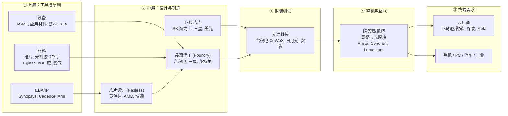

> 本文是 [[Semiconductor-industry chain-in-the-next-two-years|《未来两年全球半导体产业链深度拆解》]] 的配套科普读物，面向没有半导体背景的读者。文中行业数据与事实均引自该报告及其公开来源（WSTS、Gartner、TrendForce、公司财报等，数据截至 2026 年 7-8 月）。仅供学习参考，不构成任何投资建议。

---

## 〇、30 秒看懂半导体是干什么的

半导体是一类"导电性能可以被精确控制"的材料（最常用的是**硅**）。利用这个特性，我们可以在指甲盖大小的硅片上刻出几百亿个微型开关（**晶体管**），让电流按我们设计的方式流动——这就是**芯片**。手机、电脑、汽车、AI 服务器里的一切"计算"，本质上都是这些微型开关在开合。

**一颗 AI 芯片的诞生路径**：

```
沙子（石英砂）
  → 提纯成硅锭，切成晶圆（材料厂）
  → 用 EDA 软件设计电路图（芯片设计公司）
  → 在晶圆上"印刷"电路（晶圆代工厂，用光刻机等设备）
  → 切割、封装、测试（封测厂）
  → 装上电路板，插进服务器（云厂商的数据中心）
```

下面分四部分展开：**①产业链全景 → ②芯片是怎么造出来的 → ③名词词典 → ④读懂行业报告的三个抓手**。

---

## 一、产业链全景：五个层级，环环相扣

半导体产业链可以分成"上游支撑 → 中游制造 → 下游应用"三大段，细分为五层。一张图看懂：



### 各层一句话理解

| 层级 | 干什么 | 代表公司 | 小白类比 |
|---|---|---|---|
| **EDA/IP** | 画芯片图纸的软件与现成模块 | Synopsys、Cadence、Arm | 建筑行业的 CAD 软件 + 标准构件库 |
| **设备** | 造芯片的机器（光刻机、刻蚀机等） | ASML、应用材料、泛林、KLA | 印刷厂的印刷机 |
| **材料** | 硅片、光刻胶、特种气体等 | 信越、SUMCO、味之素 | 印刷用的纸和油墨 |
| **芯片设计** | 设计电路，自己不建厂 | 英伟达、AMD、博通 | 只出图纸的建筑设计院 |
| **晶圆代工** | 按图纸造芯片的超级工厂 | 台积电、三星、英特尔 | 承建摩天大楼的施工总包 |
| **存储** | 专门造内存和闪存 | SK 海力士、三星、美光 | 专门生产"仓库"的厂商 |
| **封装测试** | 把裸芯片打包、接线、质检 | 台积电、日月光、安靠 | 精装修 + 竣工验收 |
| **整机/互联** | 把芯片装进服务器并连成集群 | Arista、Coherent、Vertiv | 盖写字楼 + 通水通电通网 |
| **终端需求** | 买单的人 | 亚马逊、微软、谷歌、Meta | 最终住户 |

### 钱是怎么流动的？

理解行业新闻最关键的一条传导链（报告称之为"水位图"）：

> **云厂商资本开支（2026 年四大云厂合计约 7,050 亿美元）→ 向英伟达/AMD/博通下单买芯片 → 台积电的先进制程与 CoWoS 产能被锁定 → 台积电向 ASML 等买设备 → 消耗上游材料。**

所以看半导体行情，先看云厂商愿不愿意花钱；看瓶颈，就倒着往回找哪一层产能最不够。

### 三种商业模式（必懂）

- **Fabless（无厂设计）**：只设计、不制造。英伟达、AMD、博通都是。轻资产、高毛利，但要排队等代工产能。
- **Foundry（代工）**：只制造、不做自己的品牌芯片。台积电是王中王，7nm 以下先进制程占全球约 90% 份额。
- **IDM（垂直整合）**：设计制造一把抓。英特尔是传统 IDM，如今正在拆分为"自有产品 + 代工服务（Intel Foundry）"两条腿；三星、美光也属此类。
- 后道的独立封测厂叫 **OSAT**（如日月光、安靠 Amkor）。

---

## 二、芯片是怎么造出来的

### 第 0 步：从沙子到晶圆

1. 石英砂（主要成分是二氧化硅）高温提纯，得到纯度 99.999999999%（11 个 9）的电子级多晶硅；
2. 熔融后"拉"出一根圆柱形单晶硅锭（**拉晶**）；
3. 像切黄瓜一样切成薄圆片，抛光成镜面——这就是**晶圆（Wafer）**。主流尺寸是 **12 英寸（300mm）**直径。

晶圆就是芯片的"地基"，一片 12 英寸晶圆上可以做出几十到几百颗芯片。高端硅片被日本信越、SUMCO 垄断，长约已锁到 2028 年。

### 第 1 步：芯片设计（画图纸）

工程师用 **EDA 软件**（Synopsys、Cadence 两家垄断约 70%）设计电路。图纸上动辄几百亿个晶体管，人脑无法手工完成，EDA 工具负责自动布局布线和验证。设计中还会购买现成的 **IP 模块**（比如 Arm 的 CPU 架构授权），就像盖楼直接买预制构件。

设计完成的图纸送到代工厂试产，这一步叫**流片（Tape-out）**——一次先进制程流片费用可达数千万美元，所以新闻里"某公司成功流片"是个里程碑。

### 第 2 步：晶圆制造（前道工艺，最难）

在**无尘室**（比手术室干净上万倍）里，晶圆要反复经历几百道工序，核心循环是四步：

| 工序 | 干什么 | 类比 |
|---|---|---|
| **光刻** | 用光把电路图案"投影"到涂了光刻胶的晶圆上 | 幻灯片投影仪 + 感光相纸 |
| **刻蚀** | 把没有被胶保护的部分"挖掉" | 雕刻 |
| **沉积** | 在表面镀上一层新材料（金属/绝缘层） | 喷漆、电镀 |
| **离子注入** | 往硅里掺杂质，改变局部导电性 | 给面团局部加酵母 |

这个循环重复几十上百遍，一层层叠出立体电路，中间穿插 **CMP**（化学机械抛光，把每层磨平）和无数次**量测/检测**（KLA 的活，相当于质检）。

**光刻是皇冠上的明珠**。分辨率的极限取决于光的波长：

- **DUV**（深紫外光）：波长长一些，浸润式 DUV 能造到 7nm 左右，中国大陆受出口管制只能用它；
- **EUV**（极紫外光）：波长 13.5nm，7nm 以下必备，**全球只有 ASML 一家能造**，单台约 1.5-2 亿美元；
- **High-NA EUV**：新一代 EUV，镜头数值孔径更大，单台 3.8-4 亿美元，2027-2028 年才验证经济性——太贵了，台积电都在犹豫要不要用。

### "7nm、3nm、2nm"到底是什么意思？

这是**制程节点**的名称。早年它大致代表晶体管的实际尺寸，现在更多是**营销代号**，代表"这一代比上一代更密、更快、更省电"。越小越先进，但也越贵：

- 一片 3nm（N3）晶圆代工价约 2 万美元，2nm（N2）约 3 万美元，下一代 A16 预计 4-4.5 万美元；
- **晶体管变便宜的时代已经结束**——这是理解近两年芯片涨价的底层逻辑。

各家命名不同：台积电叫 N3/N2/A16，英特尔叫 Intel 3/18A/14A，三星叫 SF3/SF2。大致对标：N2 ≈ 18A ≈ SF2。

**晶体管本身也在进化**（小白记住三代名字即可）：

- **FinFET**（鳍式晶体管，16nm–3nm 主流）：电流通道像鱼鳍一样竖起来；
- **GAA**（全环绕栅极，2nm 时代）：电流通道被栅极从四面包住，漏电更少；
- **背面供电（BSPDN）**：把供电线从芯片正面挪到背面，给信号线腾地方——台积电 A16 和英特尔 18A 首次使用，也是当前良率爬坡最陡的坎。

### 良率：决定赚钱还是亏钱

一片晶圆上总有一部分芯片是坏的。**良率 = 好芯片 ÷ 总芯片数**。新工艺量产初期良率可能只有 50-60%，要花一两年"爬坡"到 85-90% 以上才赚钱。新闻里的"良率爬坡"就是在说这个过程——英特尔 18A 良率从 65% 爬到 85% 用了一年。

### 第 3 步：封装测试（后道工艺，正在逆袭）

造好的晶圆经过测试、切割（每颗独立的裸片叫 **die**），然后封装：给裸片装上外壳、接出引脚、再测试一次。

传统封装只是"包装"，但**先进封装**已经成为决定 AI 芯片性能的战略环节：

- **2.5D 封装**：把多块 die 并排放在一块"硅中介层"上，实现超高密度互联。台积电的 **CoWoS** 就是这一类——英伟达 GPU + HBM 内存就是靠它拼在一起的，2026 年供需缺口仍约 10%，交期 52-78 周，是 AI 芯片最大的瓶颈之一；
- **3D 封装**：把 die 像楼房一样垂直堆叠（台积电 SoIC、HBM 的堆叠都是）；
- **混合键合（Hybrid Bonding）**：直接铜对铜贴合，不用凸点，堆叠密度更高，HBM4 时代的关键工艺；
- **CoPoS**：把圆形晶圆封装改成方形面板封装（"面板级封装"），一次能封更多，2027 年中试产；
- **EMIB**：英特尔的替代方案，在基板里埋"硅桥"，良率已达 98%。

封装后的芯片还需要 **ABF 载板**（味之素近乎垄断的薄膜材料）才能装上电路板——没错，就是做味精的那家味之素。

---

## 三、名词词典（按主题分组）

### 3.1 芯片的种类：谁负责算，谁负责存

| 名词 | 全称 | 一句话解释 |
|---|---|---|
| **CPU** | 中央处理器 | 通用大脑，什么都能干，但单任务快、并行弱 |
| **GPU** | 图形处理器 | 为并行计算而生：几万个简单核心同时干活，恰好完美匹配 AI 训练，英伟达靠它称王 |
| **ASIC** | 专用集成电路 | **为单一任务定制的芯片**。砍掉一切不需要的功能，换来同任务下更高的能效比和更低的成本 |
| **XPU** | — | 行业对"各种定制 AI 加速芯片"的统称，本质是 ASIC |
| **TPU** | 张量处理器 | 谷歌自研的 AI ASIC，由博通参与设计，是定制 ASIC 路线的标杆 |
| **NPU** | 神经网络处理器 | 手机/PC 上跑 AI 推理的小型 ASIC |
| **SoC** | 片上系统 | 把 CPU、GPU、内存控制器等集成在一颗芯片上，手机芯片都是 SoC |

**GPU vs ASIC 怎么理解？** GPU 像瑞士军刀——什么都能切，灵活但费电；ASIC 像专用裁纸刀——只能裁纸，但裁得又快又省电。AI 需求从"探索期"进入"定型期"后，云厂商发现推理任务高度重复，于是纷纷找博通、迈威尔定制 ASIC（谷歌 TPU、亚马逊 Trainium、微软 Maia），这就是报告里说的"定制 ASIC 双轨通胀"。

### 3.2 存储：数据的"仓库"

| 名词 | 一句话解释 |
|---|---|
| **DRAM** | 内存：通电才能存数据，快但断电就丢。电脑里的内存条就是它 |
| **NAND** | 闪存：断电也能存，慢一些但便宜。SSD、手机存储都是它 |
| **DDR5** | 当前主流的 DRAM 标准（第 5 代双倍速率），服务器和 PC 内存条 |
| **HBM** | **高带宽内存**：把 8-16 层 DRAM die 垂直堆叠、用数千个微型通道（TSV）连通，再贴着 GPU 封装。牺牲容量换极致带宽——AI 芯片的"贴身口粮" |
| **HBM4** | 下一代 HBM（2026 年量产），堆 12-16 层，带宽再翻倍；英伟达 Rubin 每颗 GPU 配 8 颗 HBM4 |

**为什么 HBM 这么贵、这么缺？** 三个原因：① 每 GB 的 HBM 要消耗约 3 倍于 DDR5 的晶圆产能；② 堆叠工艺良率低、制造慢；③ AI 芯片对它的需求爆炸。它已占全球 DRAM 晶圆投片的 23%，反过来把普通内存的价格也挤上了天——报告把这场存储涨价称为 **"memflation"（memory + inflation）**。

存储三巨头：**SK 海力士**（HBM 份额 56-57%，第一）、**三星**、**美光（MU）**（美股最纯的存储标的）。中国追赶者是 **CXMT（长鑫存储）**，常规 DRAM 扩产快，但 HBM 还差 2-3 年。

### 3.3 制造与设备

| 名词 | 一句话解释 |
|---|---|
| **制程节点** | "几代工艺"的代号（N3/N2/A16、18A/14A），越小越先进也越贵 |
| **FinFET / GAA** | 晶体管的两代结构，2nm 时代从 FinFET 切换到 GAA |
| **光刻机** | 把电路图案投影到晶圆上的机器，最贵的单台设备 |
| **EUV / DUV / High-NA** | 三代光刻技术，EUV 是 7nm 以下必需品且 ASML 独家 |
| **光罩（Mask）** | 光刻用的"底片"，一套先进制程光罩价值数百万美元 |
| **良率（Yield）** | 一片晶圆上合格芯片的比例，新工艺的生命线 |
| **WFE** | 晶圆厂设备支出（Wafer Fab Equipment），衡量设备行业景气度的核心指标，2026 年约 1,450 亿美元 → 2028 年预计 2,160-2,500 亿 |
| **摩尔定律** | "晶体管数量每 18-24 个月翻倍、成本下降"的历史规律；现在**经济学部分已经失效**——单位晶体管成本首次停止下降 |

### 3.4 封装与互联

| 名词 | 一句话解释 |
|---|---|
| **CoWoS** | 台积电的 2.5D 先进封装技术，把 GPU 和 HBM 拼在硅中介层上，AI 芯片的"组装车间"，当前最紧缺的产能之一 |
| **CoPoS** | 面板级封装：把圆形晶圆换成方形面板，一次封更多芯片，2027 年试产 |
| **SoIC** | 台积电的 3D 堆叠封装（die 摞 die） |
| **EMIB** | 英特尔的先进封装方案，用埋在基板里的"硅桥"连接多块 die |
| **TSV** | 硅通孔：在硅片上打穿垂直的导电孔，HBM 堆叠靠它连通各层 |
| **混合键合** | 铜对铜直接贴合的堆叠工艺，比传统凸点连接更密，HBM4+ 的关键 |
| **OSAT** | 独立封装测试厂（日月光、安靠），承接台积电吃不下的封装订单 |
| **ABF 载板** | 芯片和电路板之间的高性能"转接插座"，味之素垄断关键薄膜材料 |

### 3.5 网络与光通信：把一万张卡连成一台计算机

AI 训练需要上万颗 GPU 协同工作，芯片之间的"网线"成了新瓶颈：

| 名词 | 一句话解释 |
|---|---|
| **光模块** | 把电信号转成光信号（再转回来）的器件，数据中心之间用光纤传输全靠它 |
| **1.6T / 3.2T** | 光模块的速率代际（每秒 1.6/3.2 万亿比特），2026 年是 1.6T 放量元年 |
| **EML 激光器** | 光模块里的光源，200G EML 是当前光链条最紧缺的单点（Lumentum、Coherent 的主要产品） |
| **CPO** | 共封装光学：把光引擎直接封进交换芯片旁边，省掉长距离电传输，更省电——但量产良率目前只有约 50% |
| **SerDes** | 芯片间高速传输数据的串行接口电路，速率越高越难做（Marvell、Credo 的强项） |
| **NVLink** | 英伟达私有的 GPU 互联协议，自家生态的"高速公路" |
| **以太网 vs InfiniBand** | AI 集群的两条网络路线：InfiniBand 性能强但是英伟达私有；以太网开放便宜，正在追赶 |

### 3.6 行业与商业术语

| 名词 | 一句话解释 |
|---|---|
| **资本开支（Capex）** | 企业买设备/建厂的长期投入。云厂 Capex 是整条产业链的"总水龙头" |
| **WSTS / Gartner / TrendForce** | 三大行业数据机构，报告里所有市场规模数据的来源 |
| **book-to-bill** | 设备订单出货比，>1 说明订单比交付多、行业在扩张；跌破 1 是周期拐点的领先指标 |
| **后结算定价** | 存储厂的新玩法：先交货，期末按市场价补差价——涨价风险全转嫁给买家 |
| **流片（Tape-out）** | 设计图交付代工厂试产，芯片设计公司的"交卷时刻" |
| **国产替代/国产化率** | 中国大陆用国产设备材料替代进口的比例，2026 年设备国产化率约 35%，新产线强制 ≥50% |

### 3.7 材料里的"扫地僧"（看似不起眼，断供就停产）

| 材料 | 用途 | 为什么紧缺 |
|---|---|---|
| **T-glass 玻纤布** | AI 服务器 PCB 的核心绝缘材料 | 交期 40 周+，新产能 2027 年才释放 |
| **ABF 膜** | 高端芯片载板的绝缘层 | 味之素近乎垄断，扩产要 2-3 年 |
| **氦气** | EUV 光刻与晶圆制造的冷却/保护气 | 供应集中在卡塔尔等少数地区 |
| **特种气体**（六氟丁二烯等） | 刻蚀工艺 | 美韩双垄断 |
| **高端硅片** | 芯片的地基 | 信越/SUMCO 长约锁到 2028 |
| **MLCC** | 微型电容，电路板的"稳压器" | AI 机柜用量是传统服务器 10 倍 |

这些材料的共性：**建厂要 2-4 年、客户认证要 6-18 个月**——一旦短缺，砸钱也快不起来。这就是本轮周期和 2021 年"恐慌性囤货"式缺芯的本质区别：这次是产能真的不够。

---

## 四、读懂半导体新闻/报告的三个抓手

**抓手一：跟着钱走。** 产业链的总水源是云厂商资本开支。只要亚马逊/微软/谷歌/Meta 还在上调资本开支指引，上游每一层就有生意；首次出现两家以上同季下修，就是周期见顶的最重要信号。

**抓手二：定价权在瓶颈手里。** 同一个 AI 浪潮里，最赚钱的不是"需求最大"的环节，而是"供给最卡"的环节——HBM 的美光/SK 海力士、先进制程的台积电、EUV 的 ASML、200G EML 的 Lumentum。判断一家公司有没有超额利润，就问一句：**它的产能是不是别人绕不开的瓶颈？**

**抓手三：同一条新闻，对不同环节含义相反。** 例如"CoWoS 交期缩短"：对靠稀缺收租的台积电是利空（涨价逻辑弱化），对被产能卡脖子的英伟达和 ASIC 客户反而是利多（能交更多货了）。读行业新闻时先想清楚自己站在链条的哪一环。

---

## 五、延伸笔记

- 主报告：[[Semiconductor-industry chain-in-the-next-two-years|未来两年（2026H2–2028H1）全球半导体产业链深度拆解]]
- 待回填的独立概念笔记：[[HBM]]、[[CoWoS]]、[[EUV 光刻]]、[[定制 ASIC]]、[[台积电]]、[[英伟达]]、[[美光]]

---

*免责声明：本文为科普性质的知识整理，基于公开信息与既有研究报告编写，仅供学习参考，不构成任何投资建议。文中涉及的公司仅为说明产业链结构之用。*
